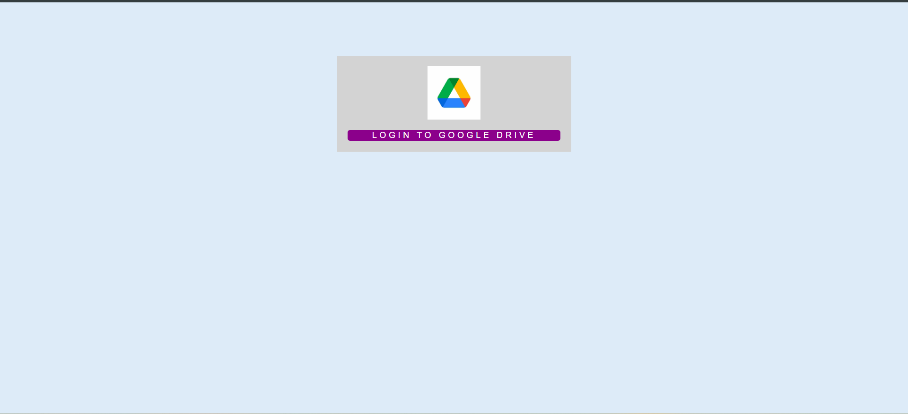
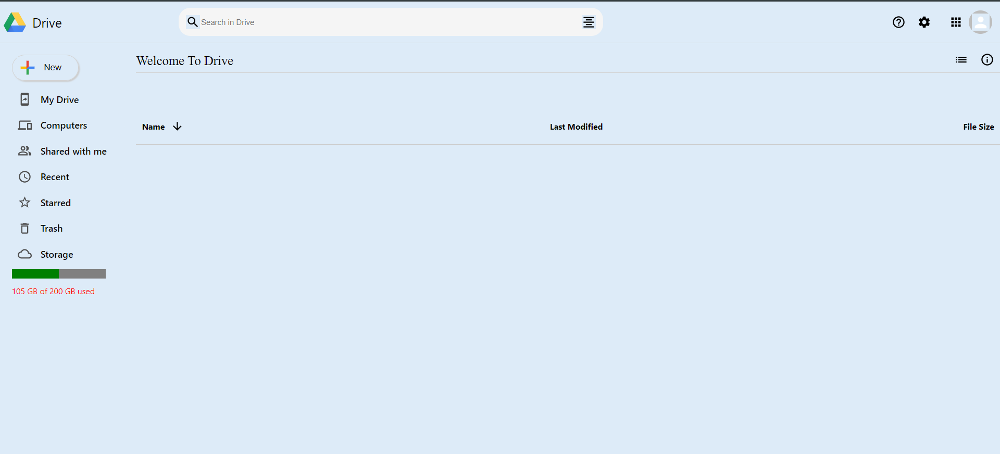
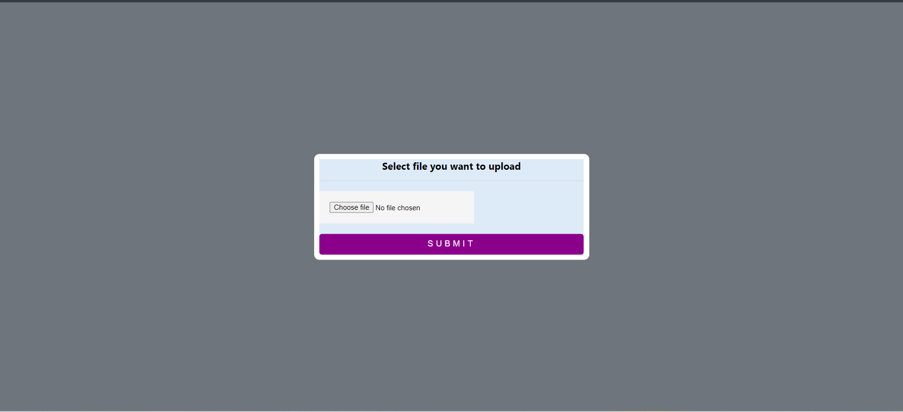

# Google Drive Clone App

## Description

This is a full-stack web application replicating the core functionalities of Google Drive using React for the front-end and Firebase for the back-end. The app features user authentication, file upload, storage, and retrieval, as well as real-time updates and an intuitive user interface.

## Features

- **User Authentication**: Secure user authentication using Firebase Authentication with Google Sign-In.
- **File Storage**: Upload, store, and retrieve files using Firebase Storage.
- **Real-time Database**: Real-time data storage and retrieval with Firebase Firestore, enabling instant updates to the file list.
- **User Interface**: Intuitive and responsive UI designed with React and Styled-Components, mimicking the look and feel of Google Drive.
- **File Management**: Users can upload, view, and manage files, with details such as name, size, and last modified date displayed.
- **Search Functionality**: Integrated search feature to quickly find files within the drive.
- **Responsive Design**: Fully responsive design for a seamless experience across different devices.

## Screenshot





## Technologies Used

- **Front-end**: React, Styled-Components, Material-UI
- **Back-end**: Firebase Firestore, Firebase Authentication, Firebase Storage

## Installation

1. Clone the repository:

   ```sh
   git clone https://github.com/adityagangil/Google-Drive-Clone
   cd google-drive-clone
   ```

2. Install dependencies:

   ```sh
   npm install
   ```

3. Set up Firebase:

   - Create a Firebase project at [Firebase Console](https://console.firebase.google.com/).
   - Enable Firebase Authentication and Firestore.
   - Create a `firebase.js` file in the `src` folder and add your Firebase configuration:

   ```javascript
   import firebase from "firebase/app";
   import "firebase/firestore";
   import "firebase/auth";
   import "firebase/storage";

   const firebaseConfig = {
     apiKey: "YOUR_API_KEY",
     authDomain: "YOUR_AUTH_DOMAIN",
     projectId: "YOUR_PROJECT_ID",
     storageBucket: "YOUR_STORAGE_BUCKET",
     messagingSenderId: "YOUR_MESSAGING_SENDER_ID",
     appId: "YOUR_APP_ID",
   };

   const firebaseApp = firebase.initializeApp(firebaseConfig);
   const db = firebaseApp.firestore();
   const auth = firebase.auth();
   const storage = firebase.storage();
   const provider = new firebase.auth.GoogleAuthProvider();

   export { db, auth, storage, provider };
   ```

4. Run the app:
   ```sh
   npm start
   ```

## Usage

- **Login**: Click on the "Login To Google Drive" button to sign in with your Google account.
- **Upload Files**: Click the "New" button on the sidebar to upload files.
- **Manage Files**: View, search, and manage your uploaded files.

## Contributing

Contributions are welcome! Please create a pull request or open an issue to discuss any changes.

## License

This project is licensed under the MIT License. See the [LICENSE](LICENSE) file for details.

## Acknowledgements

- Google Drive for the inspiration.
- Firebase for providing a comprehensive backend solution.
- The React community for continuous support and development.

---

**Author**: [Aditya Gangil](https://github.com/adityagangil)
